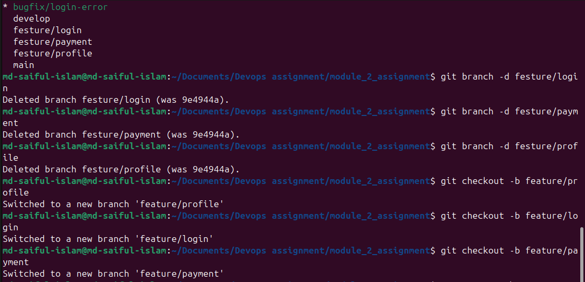
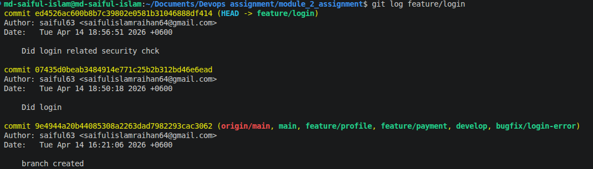
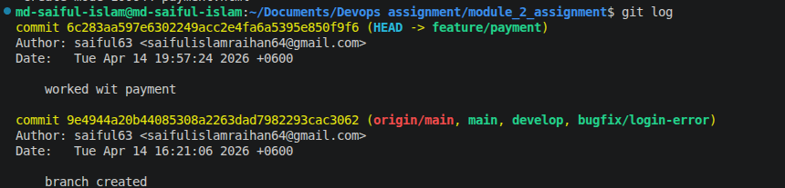
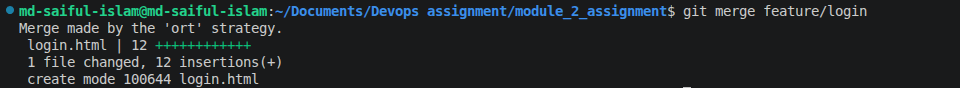
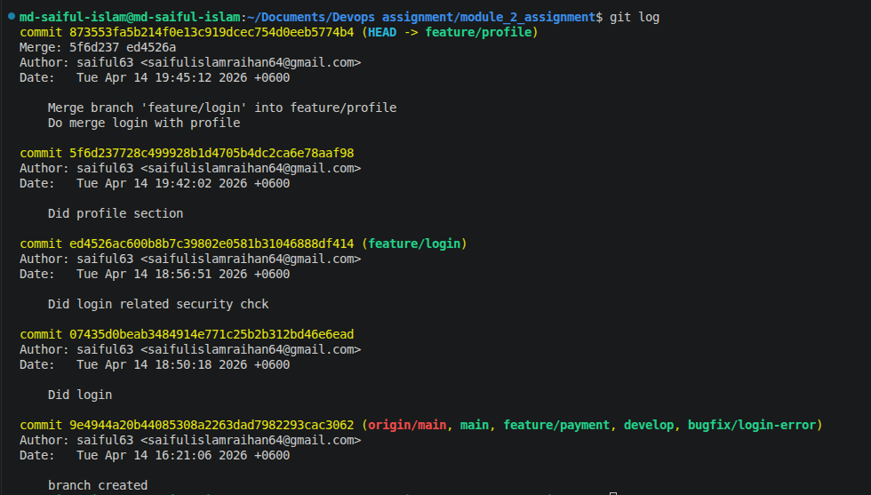

### 1.Command that are used  

```
1.git add .
2.git commit -m "message"
3.git push origin "branch_name"
4.git checkout -b "branch create and checkout"
5.git chekout "branch_name"
6.git log
7.git merge "branch_name"
8.git rebase "branch_name"
```
1.git add .: Prepares all modified and new files to be included in the next staging.

2.git commit -m "message": Permanently saves staged changes into the local repository with a descriptive note.

3.git push origin "branch_name": Uploads local commits to the specific branch on the remote server.

4.git checkout -b "branch_name": Creates a brand new branch and immediately switches workspace to it.

5.git checkout "branch_name": Switches yworkspace from  current branch to an existing branch that is named.

6.git log: Displays a chronological list of all the commits made in current branch.

7.git merge "branch_name": Combines the work from another branch into your current branch by creating a new "merge commit" that ties both histories together.

8.git rebase "branch_name": Do same like merge but there is no extra merge commit is occured.

### Screenshot of operation

1.Branch creation


2.Login Branch history


2.Payment Branch history


### 2.Difference between merge and rebase

*Merge keep track changes of both branch , which change come from which branch it is is noticible

2.Rebase don't keep track, which come change from which branch

In screenshot, merge and rebase behaviour is given

1.Merge (login feature  with profile feature)


2.History track (Merge login with profile)


3.Rebase(Payment feature into profile)
